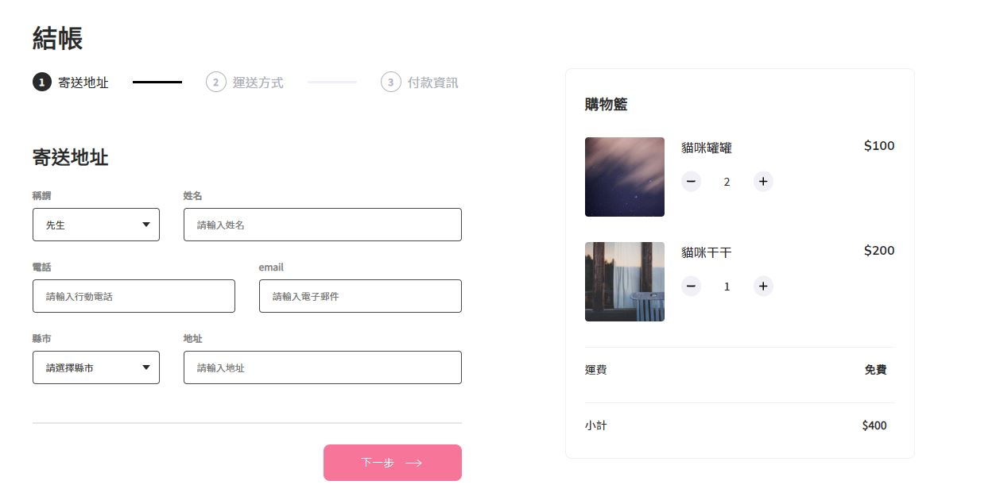

# Alpha Shop

依據[專案設計稿](https://www.figma.com/file/8D1kUmCDV02GGGroemX8SF/ACCapstone%3A-Frontend-UI?node-id=3%3A5)，以 React 框架實作購物車畫面。

## Description

1. 渲染左半部 Progress 及 右半部 Cart 畫面。

2. 左半部 Progress : 可點擊下方按鈕切換 Step1 ~ Step3 表單。

3. 右半部 Cart : 可點擊 Item 內 "+" 按鈕新增/ "-"按鈕減少商品數量 & 小計顯示商品金額加總。



## Quick Start

1. 安裝 node.js 與 npm

2. 將專案 clone 到本地

3. 本地開啟後，由終端機進入資料夾，輸入:

```
npm install
```

4. 安裝完成後輸入:

```
npm start
```

5. 開啟瀏覽器即可進入此專案 : [http://localhost:3000](http://localhost:3000)

6. 若欲暫停:

```
ctrl + c
```

## Dev Tools

- Node.js 14.18.1
- Create React App
