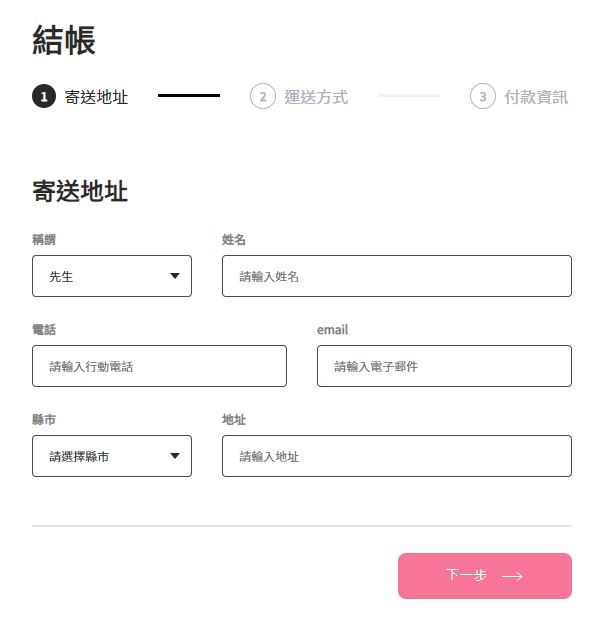

# Alpha Shop

## Description

1. 依據[專案設計稿](https://www.figma.com/file/8D1kUmCDV02GGGroemX8SF/ACCapstone%3A-Frontend-UI?node-id=3%3A5)，以 React 框架實作購物車畫面。
2. 目前先渲染 Step1 畫面。



## Quick Start

1. 安裝 node.js 與 npm

2. 將專案 clone 到本地

3. 本地開啟後，由終端機進入資料夾，輸入:

```
npm install
```

4. 安裝完成後輸入:

```
npm start
```

5. 開啟瀏覽器即可進入此專案 : [http://localhost:3000](http://localhost:3000)

6. 若欲暫停:

```
ctrl + c
```

## Dev Tools

- Node.js 14.18.1
- Create React App
